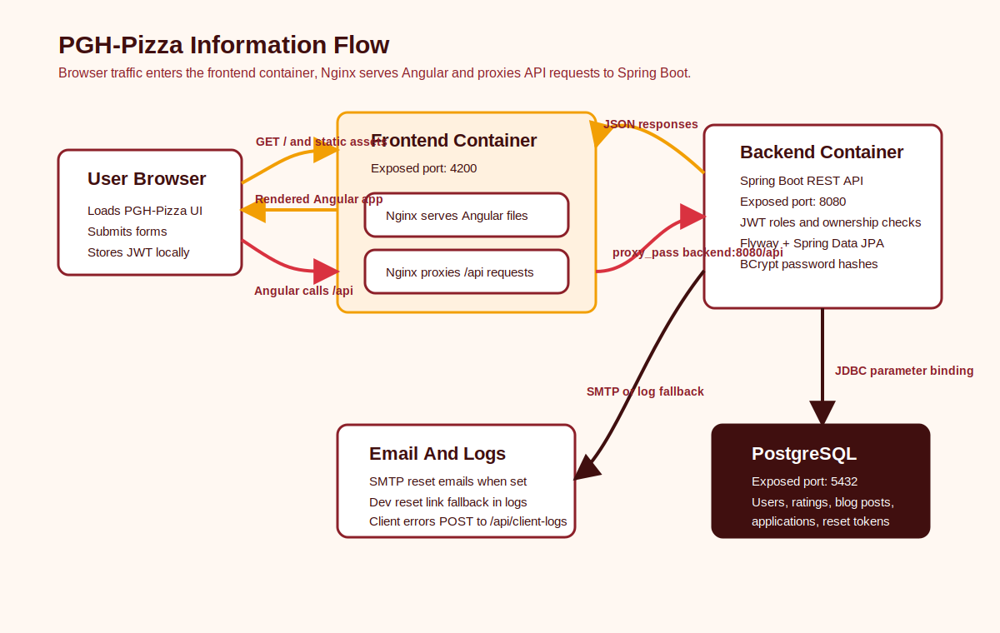

# PGH-Pizza

PGH-Pizza is split into two top-level projects:

- `frontend/`: Angular application.
- `backend/`: Spring Boot REST API.

## How The App Works

PGH-Pizza is a container-ready Angular and Spring Boot application. Users open the
frontend in their browser, and the Angular app handles public pages like Home, Ratings,
Blog, Apply, and About Me. Anonymous users can view public content and submit contributor
applications. Approved contributors can create ratings and blog posts, while admins can
approve or reject contributor applications.

In container mode, the frontend runs as an Nginx container. Nginx serves the compiled
Angular files and proxies every `/api` request to the backend container over the Docker
network. This lets the browser use the same origin for the UI and API calls, while the
backend remains a separate Spring Boot service.

The backend validates requests, checks JWT roles, enforces contributor ownership rules,
hashes passwords with BCrypt, stores only hashed password reset tokens, and uses Flyway to
create or validate the PostgreSQL schema. Spring Data JPA repositories handle database
access with parameter binding, so user input is treated as data rather than executable SQL.

Errors are handled quietly in the UI. Client errors are logged to the browser console and
sent to `POST /api/client-logs`; backend errors are written to console output and the
backend log file at `backend/logs/pgh-pizza-api.log` or the container log volume.

## Information Flow



## Local Development

Start PostgreSQL:

```powershell
docker compose up -d postgres
```

Start the backend:

```powershell
cd backend
.\mvnw spring-boot:run
```

Start the frontend:

```powershell
cd frontend
npm start
```

The frontend calls `/api`. During `npm start`, Angular proxies that to
`http://localhost:8080`. In containers, Nginx proxies `/api` to the backend container.
The backend uses PostgreSQL with database `pgh_pizza`, user `postgres`, and password
`postgres` by default.

The default local admin is `admin@pgh-pizza.local` / `ChangeMe123!`. Override it with
`PGH_ADMIN_EMAIL`, `PGH_ADMIN_PASSWORD`, and `PGH_ADMIN_DISPLAY_NAME`.

## Linux Docker Compose Server

From the repo root on a Linux server, run:

```bash
cp .env.example .env
nano .env
docker compose up -d --build
```

The compose stack runs Caddy as the public web entrypoint, the Angular frontend as a
private Nginx container, the Spring Boot backend as a private Java container, and
PostgreSQL as a private database container with a persistent Docker volume.

- `pgh-pizza-caddy`: publicly exposed on `${FRONTEND_PORT:-80}` and `${HTTPS_PORT:-443}`.
- `pgh-pizza-frontend`: private container serving Angular and proxying `/api`.
- `pgh-pizza-backend`: private Spring Boot API container.
- `pgh-pizza-postgres`: private PostgreSQL container using `pgh-pizza-postgres-data`.

For a public domain, point your domain's `A` record at the Droplet, then set:

```bash
PGH_SERVER_NAME=yourdomain.com
PGH_SITE_ADDRESS=yourdomain.com
PGH_FRONTEND_BASE_URL=https://yourdomain.com
PGH_CERTBOT_EMAIL=you@example.com
FRONTEND_PORT=80
HTTPS_PORT=443
```

With `PGH_SITE_ADDRESS=yourdomain.com`, Caddy automatically requests and renews HTTPS
certificates. To test by public IP before DNS is ready, use HTTP-only values:

```bash
PGH_SERVER_NAME=_
PGH_SITE_ADDRESS=http://YOUR_DROPLET_PUBLIC_IP
PGH_FRONTEND_BASE_URL=http://YOUR_DROPLET_PUBLIC_IP
```

For DigitalOcean firewall rules, allow public inbound `80` and `443`, restrict `22` to
your IP, and keep `8080` and `5432` closed to the public internet.

Useful server checks:

```bash
docker compose ps
docker compose logs -f caddy
docker compose logs -f backend
```

## Linux Hybrid Server

If you prefer PostgreSQL in Docker but backend/frontend on host systemd services, run:

```bash
bash scripts/install-and-run-linux.sh
```
